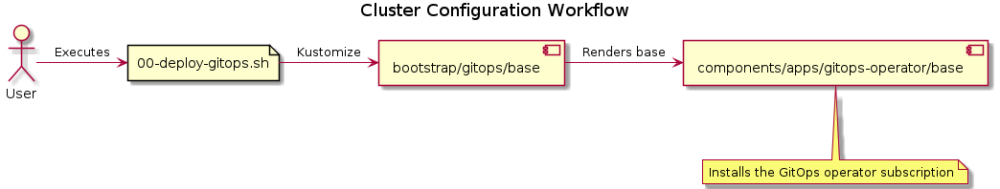

# Table of Contents

1.  [Cluster configuration workflow](#org3bc8118)
    1.  [Bootstrapping the GitOps operator](#orgdf98772)
    2.  [Deploying the cluster configuration](#org094dc8c)

# Cluster configuration workflow

To configure an OpenShift cluster we need to

-   deploy the GitOps Operator to the cluster
-   deploy the cluster configuration via ArgoCD

## Bootstrapping the GitOps operator

First we need to bootstrap ArgoCD via the OpenShift GitOps operator:

## Deploying the cluster configuration

Because we deployed the GitOps operator in the previous step, we are now
able to create ArgoCD applications.

We leverage the [App of Apps](https://argo-cd.readthedocs.io/en/stable/operator-manual/declarative-setup/#app-of-apps) pattern. A cluster definition contains an
ArgoCD App of Apps that deploys applications managing a single components.

Sounds crazy? Yes, indeed. A picture is worth more than a thousand words:

