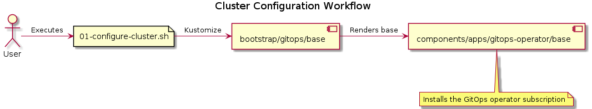

# Table of Contents

1.  [Basic cluster configuration workflow](#org708f3ec)
    1.  [Bootstrapping GitOps operator](#orge3610a0)
    2.  [Deploying the cluster configuration](#orge406a98)

# Basic cluster configuration workflow

## Bootstrapping GitOps operator

## Deploying the cluster configuration

Because we deployed the GitOps operator in the previous step, we are now
able to create ArgoCD applications (and [App of Apps](https://argo-cd.readthedocs.io/en/stable/operator-manual/declarative-setup/#app-of-apps)).

